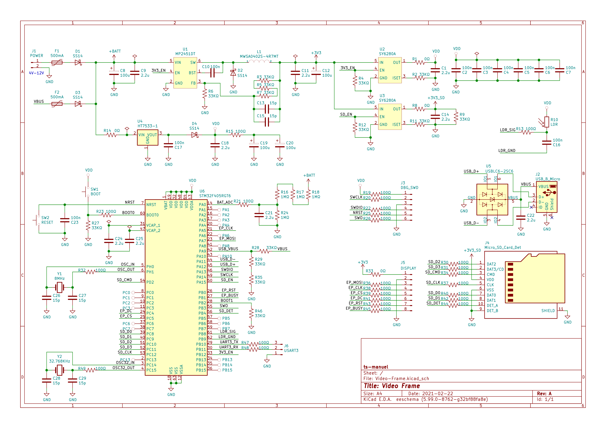

# Video Frame

<!-- TABLE OF CONTENTS -->

  
Table of Contents

  <ol>
    <li>
      <a href="#about-the-project">About The Project</a>
    </li>
    <li>
      <a href="#getting-started">Getting Started</a>
      <ul>
        <li><a href="#prerequisites">Prerequisites</a></li>
        <li><a href="#compiling">Compiling</a></li>
        <li><a href="#usb-bootloader">USB Bootloader</a></li>
      </ul>
    </li>
    <li><a href="#how-to-operate">How to Operate</a></li>
      <ul>
        <li><a href="#circuit-diagram">Circuit Diagram</a></li>
        <li><a href="#buttons">Buttons</a></li>
        <li><a href="#configuration-through-usb">Configuration through USB</a></li>
      </ul>
    <li><a href="#disclaimer">Disclaimer</a></li>
  </ol>

<!-- ABOUT THE PROJECT -->
## About The Project
This is a digital picture frame that plays movies at one frame per minute. Images appear on a [7-Color ePaper display](https://www.waveshare.com/5.65inch-e-paper-module-f.htm). The whole movie is stored as a sequence of jpeg images on an SD-Card. An STM32 microcontroller does the jpeg decoding and drives the display.

e-Paper displays maintain the displayed image without needing any power. The image is updated every 24 minutes and an update cycle takes 18 seconds. Since the device is in sleep mode for the majority of the time, power draw is minimal and the batteries last for a decent amount of time.

The device is powered by 6 AA batteries.

For more info check out the [full log on hackaday.io](https://hackaday.io/project/177197-the-slowest-video-player-with-7-colors)

<!-- GETTING STARTED -->
## Getting Started
### Prerequisites
* [STM32CubeIDE 1.4.0](https://www.st.com/en/development-tools/stm32cubeide.html)
* [dfu-util](http://dfu-util.sourceforge.net/)

### Compiling
* Open STM32CubeIDE
* Select a folder as workspace (this can be any folder in your hard-drive)
* Click on `File > Import`
* Select `General > Existing Project into Workspace` then click next
* Browse for the folder `stm32` select the project and click finish

### USB bootloader
* Connect the USB cable, check that the [correct drivers](https://www.hanselman.com/blog/how-to-fix-dfuutil-stm-winusb-zadig-bootloaders-and-other-firmware-flashing-issues-on-windows) are installed
* Enter DFU mode by pressing the RESET while holding down the BOOT button
* Use the following command to flash the firmware

      dfu-util -a0 -s 0x08000000 0 -D "Video Frame.bin"

<!-- HOW TO OPERATE -->
## How to Operate
### Circuit Diagram

### Buttons
* **RESET**: Press during sleep to wake the microcontroller and initiate a display update cycle.
* **BOOT**: Hold down during reset to enter DFU mode. Press during display update to receive commands from the serial port.

### Configuration through USB
The USB emulates a serial port that can be used to configure the device. During normal operation, a timer interrupt wakes the microcontroller every 24 minutes to update the display. An update cycle can also be triggered by pressing the **RESET** button. By default, the microcontroller goes back into sleep mode immediately after the display has been updated. By pressing the **BOOT** button while the display is updating, the microcontroller starts listening for commands on the serial port. After 60 seconds of inactivity, the microcontroller goes back to sleep.

The following is a list of commands that can be entered.
> ***load FOLDER/FILE.jpg*** loads the specified file from the SD card

> ***update*** triggers an update cycle

> ***sleep*** enters sleep mode immediately

<!-- DISCLAIMER -->
## Disclaimer
The following project is shared "as is", with the sole objective of being useful. The creator of the described piece of hardware and its associated software cannot guarantee its correct functioning under any circumstance. The author of this project will not be held responsible for any material, personal or economic losses to you or any third parties that may arise from using this design. This project will not be used under any circumstances on systems whose responsibility is critical, or from which people's lives depend upon, directly or indirectly.