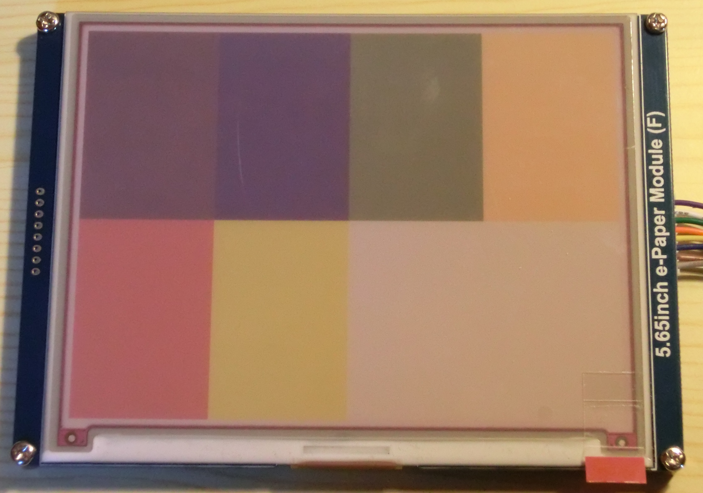
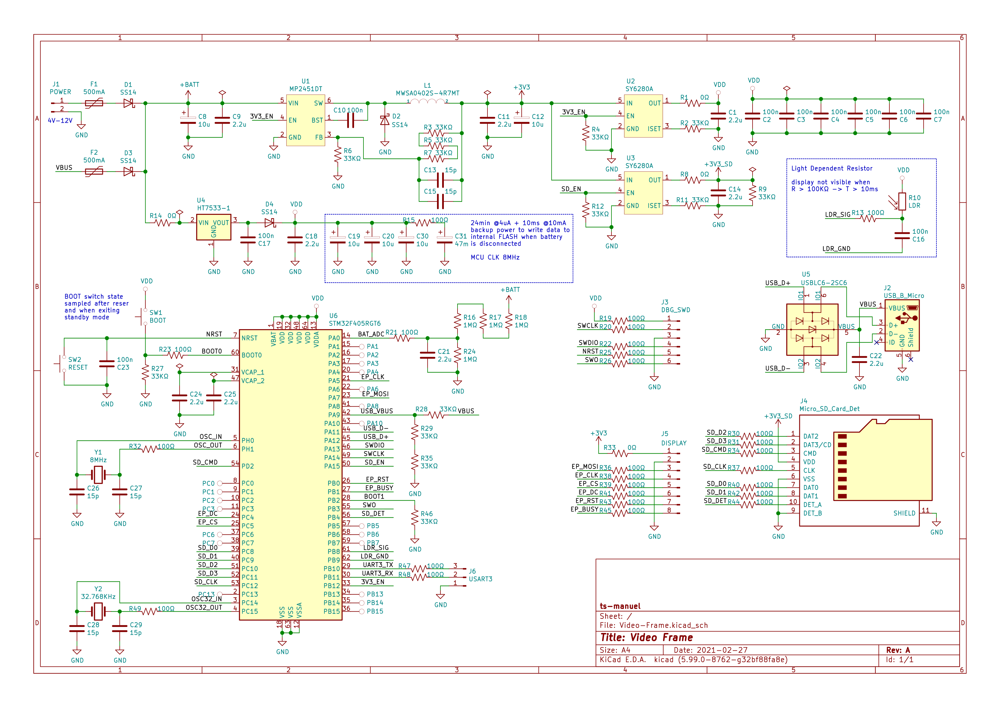

# Video Frame

<!-- TABLE OF CONTENTS -->

  
Table of Contents

  <ol>
    <li>
      <a href="#about-the-project">About The Project</a>
    </li>
    <li>
      <a href="#getting-started">Getting Started</a>
      <ul>
        <li><a href="#prerequisites">Prerequisites</a></li>
        <li><a href="#compiling">Compiling</a></li>
      </ul>
    </li>
    <li><a href="#circuit-diagram">Circuit Diagram</a></li>
    <li><a href="#disclaimer">Disclaimer</a></li>
  </ol>

<!-- ABOUT THE PROJECT -->
## About The Project
This is like a  digital picture frame, but instead of showing a sequence of photos, it plays a movie frame by frame. Images appear on a [7-Color ePaper display](https://www.waveshare.com/5.65inch-e-paper-module-f.htm). The whole movie is stored as a sequence of jpeg images on an SD-Card. The STM32 microcontroller reads from the SD-Card and updates the display at a rate of one frame per minute. The idea is not mine, the first time I saw something similar was on [Hackaday.io](https://hackaday.io/project/175630-slowmovie-cinema-on-a-27-epaper-display). As far as I know, nobody has made something like this with a color ePaper display.

The plan is to make a standalone device that is battery-powered. Hardware is pretty simple, just a microcontroller, SD-Card, and the display.

For more info check out the [full log on hackaday.io](https://hackaday.io/project/177197-the-slowest-video-player-with-7-colors)

<!-- GETTING STARTED -->
## Getting Started
### Prerequisites
* [STM32CubeIDE 1.3.0](https://www.st.com/en/development-tools/stm32cubeide.html)

### Compiling
* Open STM32CubeIDE
* Select a folder as workspace (this can be any folder in your hard-drive)
* Click on `File > Import`
* Select `General > Existing Project into Workspace` then click next
* Browse for the folder `stm32` select the project and click finish

<!-- GETTING STARTED -->
## Circuit Diagram

<!-- DISCLAIMER -->
## Disclaimer
The following project is shared "as is", with the sole objective of being useful. The creator of the described piece of hardware and its associated software cannot guarantee its correct functioning under any circumstance. The author of this project will not be held responsible for any material, personal or economic losses to you or any third parties that may arise from using this design. This project will not be used under any circumstances on systems whose responsibility is critical, or from which people's lives depend upon, directly or indirectly.